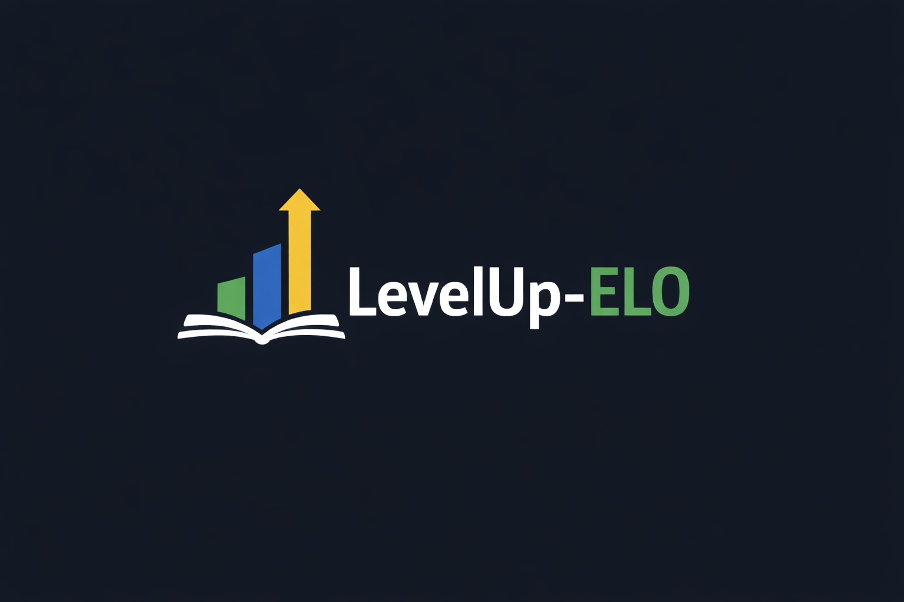

# 🎮 LevelUp-ELO | Adaptive Learning & Skill Engine

<p align="center">
  
</p>

**LevelUp-ELO** es un motor de aprendizaje adaptativo diseñado para estimar con precisión la habilidad de un estudiante mediante el algoritmo **ELO Vectorial**. El sistema no solo evalúa, sino que selecciona dinámicamente retos dentro de la **Zona de Desarrollo Próximo (ZDP)** del usuario para maximizar la eficiencia del aprendizaje.


## 🚀 Características Destacadas

* **📈 Evaluación Dinámica:** Actualización instantánea del ELO tras cada respuesta (Correcta, Incorrecta o Salto).
* **🎯 Algoritmo de Selección:** Selector inteligente que busca ítems en el banco de preguntas cuya dificultad coincida con el nivel actual del usuario.
* **📊 Dashboard de Analítica:** Visualización en tiempo real de la curva de aprendizaje y métricas de precisión.
* **🎨 UI Responsive:** Interfaz moderna y oscura (Dark Mode) adaptada para dispositivos móviles y escritorio utilizando Streamlit.
* **📉 Retroalimentación Visual:** Gráficos de evolución que cambian de color (Verde/Rojo) según la tendencia de rendimiento inmediata.


## 🛠️ Tecnologías Utilizadas


## 📐 Arquitectura del Proyecto

El sistema se divide en módulos lógicos para separar la matemática de la interfaz:


* **`elo/`**: Contiene la lógica del **ELO Vectorial** y los modelos de datos de los ítems.
* **`selector/`**: Implementa el `AdaptiveItemSelector` para la búsqueda de retos óptimos.
* **`items/`**: Almacena el `bank.json`, la fuente de verdad de los contenidos educativos.
* **`app.py`**: El orquestador de la interfaz y gestor del estado de la sesión.


## 🧠 Lógica de Convergencia

El motor utiliza un ciclo de retroalimentación continua:
1.  **Estimación Inicial:** Se asigna un ELO base de 1000 puntos.
2.  **Desafío Adaptativo:** El selector elige una pregunta que represente un reto justo (probabilidad de éxito cercana al 50%).
3.  **Actualización de Estado:** El motor ELO procesa el resultado y ajusta la habilidad mediante un factor K dinámico.
4.  **Visualización de Métricas:** Se calculan deltas (diferencias) respecto al paso anterior y al inicio de la sesión para mostrar el progreso real.


## 🚀 Instalación y Ejecución

Sigue estos pasos para probar el prototipo localmente:

1. **Clonar el repositorio:**
   ```bash
   git clone [https://github.com/TU_USUARIO/LevelUp-ELO.git](https://github.com/TU_USUARIO/LevelUp-ELO.git)
   cd LevelUp-ELO  


---
